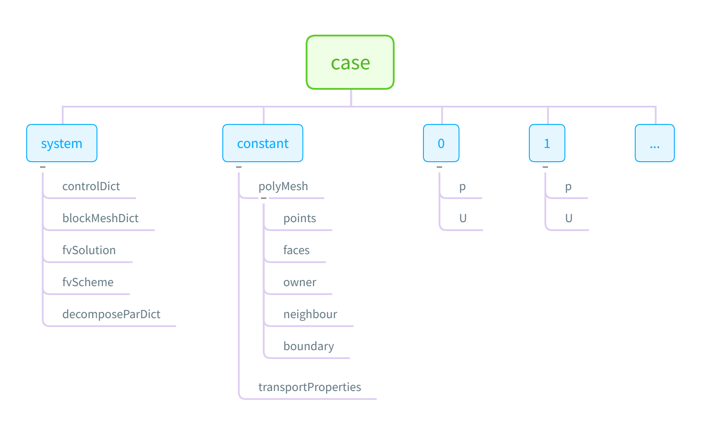

<details><summary><mark><font color=darkred>目录</font></mark></summary>
	1. 背景介绍<br>
	2. PISO 算法流程以及在icoFoam中的实现<br>
    3. icoFoam 算法框图<br>
    4. icoFoam 算法伪代码<br>
    5. icoFoam中头文件介绍<br>
    6. 主要函数和变量解析<br>
    7. 附录</details>


## <font color=#00008B>背景介绍</font>

### 问题背景

纳维-斯托克斯方程（英文名：Navier-Stokes equations），描述粘性不可压缩流体动量守恒的运动方程。简称N-S方程。粘性流体的运动方程首先由Navier在1827年提出，只考虑了不可压缩流体的流动。Poisson在1831年提出可压缩流体的运动方程。Saint-Venant在1845年，Stokes在1845年独立提出粘性系数为一常数的形式，都称为Navier-Stokes方程，简称N-S方程。
icoFoam 计算的是简化版的N-S方程：
$$
\left\{\begin{array}{l}\nabla \cdot\boldsymbol{U}=0 \\\frac{\partial \boldsymbol{U}}{\partial t}+\nabla\cdot(\boldsymbol{U}\otimes \boldsymbol{U}) - \nabla\cdot(\nu\nabla \boldsymbol{U})= -\nabla P\end{array}\right.
$$

### OpenFOAM 背景

OpenFOAM是一个完全由C++编写，在linux下运行，面向对象的计算流体力学（CFD）类库 。2004年开始OpenFOAM一直作为免费使用的开源软件，有OpenFOAM和OpenFOAM-Extened两个版本，分别由Henry Weller负责的OpenCFD以及Hrvoje Jasak负责的Wikki公司分别维护 。

### PISO 算法背景

流体力学的控制方程是耦合方程组，形式上体现为连续方程和运动方程的耦合，变量上体现为速度和压强的耦合。在数值计算过程中，同时求解速度和压强的方法通常比较困难繁琐。
因此PISO算法的基本思路为轮流求解速度和压强，即建立速度和压强之间的迭代关系，在迭代中去寻求稳定解。具体而言就是一个隐式速度预测之后紧跟一系列压强求解和显式速度校正，并在迭代的过程中考虑相邻校正（在每个迭代步中，相邻网格的速度值都会采用最新的速度预测值）。


## <font color=#00008B>PISO 算法流程以及在icoFoam中的实现</font>

$$
\left\{\begin{array}{l}\nabla \cdot\boldsymbol{U}=0 \\\frac{\partial \boldsymbol{U}}{\partial t}+\nabla\cdot(\boldsymbol{U}\otimes \boldsymbol{U}) - \nabla\cdot(\nu\nabla \boldsymbol{U})= -\nabla P\end{array}\right.
$$

### 动量预测方程

对动量方程在控制体上积分，并利用高斯散度定理得到：
$$
\int_{V}\frac{\partial \boldsymbol{U}}{\partial t}dV + \oint_{S}\boldsymbol{U} \boldsymbol{U}\cdot d\boldsymbol{S} -  \oint_{S}\nu\nabla\boldsymbol{U}\cdot d\boldsymbol{S} = \oint_{S}-Pd\boldsymbol{S}
$$
记面$f$上的通量$\Phi_f = \boldsymbol{U}_f \cdot d\boldsymbol{S}$，$r$为预测时间步，$n$为当前时间步，对方程离散得到

$$
\frac{\mathbf{U}_{\mathrm{P}}^{r}-\mathbf{U}_{\mathrm{P}}^{n}}{\Delta t} V_{\mathrm{P}}+\sum \Phi_{f}^{n} \mathbf{U}_{f}^{r} - \sum \nu \nabla_{f} \mathbf{U}^{r}\left|\mathbf{S}_{f}\right| = -\sum p_{f}^{n} \mathbf{S}_{f} \tag{1}
$$

对面速度$\boldsymbol{U}_f^r$和速度的法向面梯度$\nabla_f\boldsymbol{U}^r$需要进一步离散，这里采用$Gauss linear$
$$
\mathbf{U}_{f}^{r}=\frac{\mathbf{U}_{\mathrm{P}}^{r}+\mathbf{U}_{\mathrm{N}}^{r}}{2},\quad  p_{f}^{n}=\frac{p_{\mathrm{P}}^{n}+p_{\mathrm{N}}^{n}}{2}, \quad \nabla_{f} \mathbf{U}^{r}=\frac{\mathbf{U}_{\mathrm{N}}^{r}-\mathbf{U}_{\mathrm{P}}^{r}}{|d|}
$$
至此所有未知量的面心值都已用体心值表示，带入方程(1)化简后得到 **动量预测方程**
$$
A_{\mathrm{P}} \mathbf{U}_{\mathrm{P}}^{r}+\sum A_{\mathrm{N}} \mathbf{U}_{\mathrm{N}}^{r}=\boldsymbol{S}_{\mathrm{P}}-\sum \frac{p_{\mathrm{P}}^{n}+p_{\mathrm{N}}^{n}}{2} \mathbf{S}_{f}\tag{2}
$$
其中
$$
A_{\mathrm{P}}=\left(\frac{V_{p}}{\Delta t}+\sum \frac{\Phi_{f}^{n}}{2}+\sum \nu \frac{\left|\mathbf{S}_{f}\right|}{|d|}\right),\quad A_{\mathrm{N}}=\frac{\Phi_{f}^{n}}{2}-\nu \frac{\left|\mathbf{S}_{f}\right|}{|d|},\quad \boldsymbol{S}_{\mathrm{P}}=\frac{V_{p}}{\Delta t} \mathbf{U}_{\mathrm{P}}^{n}
$$

在当前时间步中，$A_P, A_N, \boldsymbol{S}_P$都是已知量（$\Phi$和$p$均采用当前已知的通量和压力），求解动量预测方程（2）即可获得预测速度$\mathbf{U}_{\mathrm{P}}^{r}$


### 压力泊松方程

定义$H(U)$，即动量方程（2）中除去压力项后，非对角线和源项所对应的速度场，表达式为
$$
H(\boldsymbol{U}) = \boldsymbol{S}_{\mathrm{P}}-\sum A_{\mathrm{N}} \mathbf{U}_{\mathrm{N}}
$$
所以半离散方程可写为（压力$p$不离散）：
$$
A_{P} \mathbf{U}_{P}=\mathbf{H}(\mathbf{U})-\nabla p\tag{3}
$$
即
$$
\mathbf{U}_{P}=\frac{\mathbf{H} (\mathbf{U})}{A_{P}}-\frac{1}{A_{P}} \nabla p\tag{4}
$$
由连续性方程得到**压力泊松方程**
$$
\nabla \cdot\left(\frac{\mathbf{H}(\mathbf{U})}{A_{P}}\right)  = \nabla \cdot\left(\frac{1}{A_{P}} \nabla p\right) \tag{5}
$$
对右端压力可采用Laplacian离散格式，可以求出压力$p$

为了得到通量$\Phi$， 同样在$f$的面心处也有
$$
\mathbf{U}_{f}=\left(\frac{\mathbf{H} (\mathbf{U})}{A_{P}}\right)_{f}-\left(\frac{1}{A_{P}}\right)_{f}(\nabla p)_{f}
$$
所以
$$
\Phi=\mathbf{S}_f \cdot\mathbf{U}_{f}=\mathbf{S}_f \cdot\left[\left(\frac{\mathbf{H}(\mathbf{U})}{A_{P}}\right)_{f}-\left(\frac{1}{A_{P}}\right)_{f}(\nabla p)_{f}\right]\tag{6}
$$
这也是算法中更新通量$\Phi$所用方程。

最终得到原方程的离散形式（即动量方程和压力泊松方程）
$$
\left\{
\begin{array}{l}
A_{P} \mathbf{U}_{P}=\mathbf{H}(\mathbf{U})-\nabla p \\
\sum \mathbf{S}_f \cdot\left[\left(\frac{1}{A_{P}}\right)_{f}(\nabla p)_{f}\right]=\sum \mathbf{S}_f \cdot\left(\frac{\mathbf{H}(\mathbf{U})}{A_{P}}\right)_{f}
\end{array}
\right. \tag{*}
$$

### PISO 算法流程

#### 1. 动量预测	

- 求解动量预测方程（2）得到预测速度$\mathbf{U}^r$

  ```C++
  fvVectorMatrix UEqn
      (
      fvm::ddt(U)
      + fvm::div(phi, U)
      - fvm::laplacian(nu, U)
  	);
  if (piso.momentumPredictor())
  {
      solve(UEqn == -fvc::grad(p));
  }
  ```

#### 2. 更新压力

- 用预测速度$\mathbf{U}^r$组建 $\mathbf{H}(\mathbf{U}^r)$

  ```c++
  volScalarField rAU(1.0/UEqn.A());
  volVectorField HbyA(constrainHbyA(rAU*UEqn.H(), U, p));
  surfaceScalarField phiHbyA
      (
      "phiHbyA",
      fvc::flux(HbyA)
      + fvc::interpolate(rAU)*fvc::ddtCorr(U, phi)
  	);
  adjustPhi(phiHbyA, U, p);
  // Update the pressure BCs to ensure flux consistency
  constrainPressure(p, U, phiHbyA, rAU);
  
  ```
  
- 组建压力方程（5）并求解，得到更新后的压力 $p^*$

  ```c++
   while (piso.correctNonOrthogonal())
   {
       // Pressure corrector
       fvScalarMatrix pEqn
           (
           fvm::laplacian(rAU, p) == fvc::div(phiHbyA)
       );
  
       pEqn.setReference(pRefCell, pRefValue);
  
       pEqn.solve(mesh.solver(p.select(piso.finalInnerIter())));
  
       if (piso.finalNonOrthogonalIter())
       {
           phi = phiHbyA - pEqn.flux();
       }
   }
  ```

#### 3. 显式的速度校正

- 用新的压力 $p^*$ 以及 $\mathbf{H}(\mathbf{U}^r)$ 通过（6）更新通量$\Phi$

  ```c++
  if (piso.finalNonOrthogonalIter())
  {
  	phi = phiHbyA - pEqn.flux();
  } 
  ```

- 用新的压力 $p^*$ 以及 $\mathbf{H}(\mathbf{U}^r)$ 通过（4）更新通量$\mathbf{U}$

  ```c++
  #include "continuityErrs.H"
   U = HbyA - rAU*fvc::grad(p);
   U.correctBoundaryConditions();
  ```

- 返回第二步继续求解新的压力。


## <font color=#00008B>icoFoam 算法框图</font>


## <font color=#00008B>icoFoam 算法伪代码</font>


## <font color=#00008B>icoFoam中头文件介绍</font>

```c++
#include "fvCFD.H"	//其中包含了 fvMesh.H，fvMatrix.H等。
#include "pisoControl.H"	//pisoControl类的声明
#include "postProcess.H"	//后处理头文件??
#include "addCheckCaseOptions.H"	//Foam::argList::addBoolOption
#include "setRootCaseLists.H"	//管理case运行的路径
//#include "listOptions.H"  #include "setRootCase.H"  #include "listOutput.H"

#include "createTime.H"	//创建时间控制类对象Foam::Time runTime
#include "createMesh.H"	//创建网格对象Foam::fvMesh mesh，将其注册给runTime
#include "createFields.H"	//从runTime.constant()下读入transportProperties字典
							//从runTime().timeName()下读入初始场U和p，将其注册到mesh 

#include "createPhi.H"	//在createMesh.H中被包含，用于初始化通量Phi
#include "initContinuityErrs.H"	//声明和初始化连续性误差 
#include "continuityErrs.H" //计算并输出连续性误差(调用了runTime的各种控制)

#include "CourantNo.H" //初始化CoNum = 0.0 meanCoNum = 0.0 在每个时间步输出
```


## <font color=#00008B>主要函数和变量解析</font>

[Foam::Time runTime](#1.)

[pisoControl piso](#2.)

[fvMatrix](#3.)

[GeometricField](#4.)

[fvm::	fvc::](#5.)

[constrainHbyA  (rAU\*UEqn.H(), U, p)](#6.)

[adjustPhi  (phiHbyA, U, p)](#7.)

[constrainPressure  (p, U, phiHbyA, rAU)](#8.)

[U.correctBoundaryConditions  ()](#9.)

---


<a name="1.">1.</a>Foam::Time runTime

```c++
runTime.loop()	// 如果算法应继续运行，则返回true，并根据设定的时间步长增加时间。

runTime.write() // 将在对象注册机中注册了的，设置为“需写入”的变量，在设定好的写入时机(由 							system/controlDict 确定)写入对应的位置。
//例子：
//while (runTime.loop())
//{
//    some code;
//    runTime.write();
//}

piso.momentumPredictor()
piso.correct()
```


<a name="2.">2.</a>  pisoControl piso

```c++
piso.momentumPredictor()	//流程控制函数：用于判断是否需要动量预测。
    
piso.correct()	//流程控制函数：用于判断是否需要 piso 循环。
//while (piso.correct())
//可类比
//for (int corr=0; corr<nCorr; corr++)
//其中 nCorr 为用户设定好的 piso 循环次数，等于 system/fvSolution 字典中 nCorrectors 的值
    
piso.correctNonOrthogonal()	//流程控制函数：用于判断是否需要非正交校正。
//while (piso.correctNonOrthogonal())
//可类比
//for (int Noncorr=0; Noncorr<nNonCorr; Noncorr++)
//其中 nNonCorr 为用户设定好的 piso 非正交校正循环次数，
//等于 system/fvSolution 字典中 nNonOrthogonalCorrectors 的值
    
piso.finalInnerIter()	//在最后一次 piso 循环中的最后一次非正交修正循环内返回 True，其余时候返回 False。
    
piso.finalNonOrthogonalIter()	//在每一次 piso 循环中的最后一次非正交修正循环内返回 True，其余时候返回 False。
```


<a name="3.">3.</a>fvMatrix

```c++
//typedef fvMatrix< Vector > fvVectorMatrix
//typedef fvMatrix< Scalar > fvScalarMatrix


fvVectorMatrix UEqn
    (
        fvm::ddt(U)
        + fvm::div(phi, U)
        - fvm::laplacian(nu, U)
	);
//fvVectorMatrix 由时间导数项，对流项，扩散项，离散后得到的矩阵（不仅仅是简单的矩阵）
//UEqn作为fvMatrix类对象，它保存了几何场U的地址(私有成员psi_)，所以UEqn.solve()会改变			//U; 

 fvScalarMatrix pEqn
    (
    	fvm::laplacian(rAU, p) == fvc::div(phiHbyA)
	);
//fvScalarMatrix 由压力的拉普拉斯项，和phiHbyA的散度项构成，其中“==”等价于减号“-”
                
pEqn.setReference(pRefCell, pRefValue);
//由于压力在差一个常数的意义下对方程无效，所以需要设置压力的参考值。
//具体参考单元和参考值在creteFields.H中通过读入fvSolution中PISO子字典内容进行设置

pEqn.solve(mesh.solver(p.select(piso.finalInnerIter())));
//Foam::word select	(bool final) const  返回场的名字+“Final” 
//autoPtr<fvSolver> solver(const dictionary & )	返回对应设置的求解器
```


<a name="4.">4.</a>GeometricField

```c++
//typedef GeometricField<scalar, fvPatchField, volMesh> volScalarField
//typedef GeometricField<scalar, fvsPatchField, surfaceMesh> surfaceScalarField

UEqn.A()	//tmp< volScalarField >  返回UEqn的对角元素对应的几何场 D()/psi_.mesh().V();
            
    
UEqn.H()	//tmp< GeometricField< Type, fvPatchField, volMesh > > 返回UEqn的非对角元及			 	源项对应的几何场


HbyA  //volVectorField	
phi  //surfaceScalarField	phi即是U的通量fvc::flux(U)，在createPhi.H中定义
phiHbyA	//surfaceScalarField
```


<a name="5.">5.</a>fvm::	fvc::

```c++
// 代码中用到的有限体积算子
//fvm对应隐式离散，系数存放在AX=b的A中
//fvc对应显式离散，系数存放在AX=b的b中
    
//tmp< fvMatrix< Type > >
fvm::ddt(U) // 时间导数项的离散
fvm::div(phi, U) // 对流项的离散
fvm::laplacian(nu, U) //  扩散项的离散

fvc::flux(HbyA) //surfaceScalarField 返回HbyA的界面通量，所用插值dotInterpolate() ??
    
fvc::interpolate(rAU) //GeometricField 将某个场（按给定格式）插值到面上，interpolate 中的插值					  格式可由system/fvScheme 中设置来调整。  ??
fvc::ddtCorr(U, phi) //对网格运动（如面旋转和平移）的流率修正，ddtCorr 对于在非结构网格，运用压						 力-速度耦合算法的情况，可以减少压力，速度以及速度通量的解耦。 ??
```


<a name="6.">6.</a>.constrainHbyA(rAU\*UEqn.H(), U, p)

```c++
constrainHbyA(rAU*UEqn.H(), U, p)   //内部场为rAU*UEqn.H()，constrainHbyA函数指定											//rAU*UEqn.H()的边界场
```


<a name="7.">7.</a>adjustPhi(phiHbyA, U, p);

```c++
adjustPhi(phiHbyA, U, p)	// 用于调整流率，保证其连续性，adjustPhi 返回 true 或 false，通过							一系列判断语句来判断与调整方程连续性。
```


<a name="8.">8.</a>constrainPressure(p, U, phiHbyA, rAU);

```c++
constrainPressure(p, U, phiHbyA, rAU); //用于限制/更新压力的边界值，使之与速度等物理量的边界值匹										配，来保证流量的 consistency。
```


<a name="9.">9.</a>U.correctBoundaryConditions()

```c++
U.correctBoundaryConditions() 
    
//用于针对边界条件校正边界值，调用了 evaluate() 函数（该函数用于根据邻近网格的值给边界赋值，在不同边界条件中有不同重载，也支持自定义边界条件的编写修改）用于校正边界值，调用了 evaluate() 函数（该函数在不同边界条件中有不同重载，对边界条件的调用也不同）
```


## <font color=#00008B>附录</font>

### icoFoam.C

```c++
#include "fvCFD.H"
#include "pisoControl.H"


int main(int argc, char *argv[])
{
    argList::addNote
    (
        "Transient solver for incompressible, laminar flow"
        " of Newtonian fluids."
    );

    #include "postProcess.H"

    #include "addCheckCaseOptions.H"
    #include "setRootCaseLists.H"
    #include "createTime.H"
    #include "createMesh.H"

    pisoControl piso(mesh);

    #include "createFields.H"
    #include "initContinuityErrs.H"

    Info<< "\nStarting time loop\n" << endl;
    while (runTime.loop())
    {
        Info<< "Time = " << runTime.timeName() << nl << endl;

        #include "CourantNo.H"

        // Momentum predictor
        fvVectorMatrix UEqn
        (
            fvm::ddt(U)
          + fvm::div(phi, U)
          - fvm::laplacian(nu, U)
        );

        if (piso.momentumPredictor())
        {
            solve(UEqn == -fvc::grad(p));
        }

        // --- PISO loop
        while (piso.correct())
        {
            volScalarField rAU(1.0/UEqn.A());
            volVectorField HbyA(constrainHbyA(rAU*UEqn.H(), U, p));
            surfaceScalarField phiHbyA
            (
                "phiHbyA",
                fvc::flux(HbyA)
              + fvc::interpolate(rAU)*fvc::ddtCorr(U, phi)
            );

            adjustPhi(phiHbyA, U, p);

            // Update the pressure BCs to ensure flux consistency
            constrainPressure(p, U, phiHbyA, rAU);

            // Non-orthogonal pressure corrector loop
            while (piso.correctNonOrthogonal())
            {
                // Pressure corrector

                fvScalarMatrix pEqn
                (
                    fvm::laplacian(rAU, p) == fvc::div(phiHbyA)
                );

                pEqn.setReference(pRefCell, pRefValue);

                pEqn.solve(mesh.solver(p.select(piso.finalInnerIter())));

                if (piso.finalNonOrthogonalIter())
                {
                    phi = phiHbyA - pEqn.flux();
                }
            }

            #include "continuityErrs.H"

            U = HbyA - rAU*fvc::grad(p);
            U.correctBoundaryConditions();
        }

        runTime.write();

        runTime.printExecutionTime(Info);
    }

    Info<< "End\n" << endl;

    return 0;
}

//icoFoam单步的输出信息
Time = 0.5

Courant Number mean: 9.45409e-05 max: 9.45409e-05
smoothSolver:  Solving for Ux, Initial residual = 0.00461936, Final residual = 1.21109e-10, No Iterations 1
smoothSolver:  Solving for Uy, Initial residual = 0.00237121, Final residual = 7.21707e-11, No Iterations 1
DICPCG:  Solving for p, Initial residual = 9.52167e-05, Final residual = 3.42699e-07, No Iterations 2
time step continuity errors : sum local = 5.77897e-12, global = 3.23117e-28, cumulative = -1.08737e-20
DICPCG:  Solving for p, Initial residual = 3.42665e-07, Final residual = 3.42665e-07, No Iterations 0
time step continuity errors : sum local = 5.84564e-12, global = 0, cumulative = -1.08737e-20
ExecutionTime = 3.39 s  ClockTime = 4 s
```


### createFields.H

```C++
Info<< "Reading transportProperties\n" << endl;

IOdictionary transportProperties//索引名
(
    IOobject//对象注册机
    (
        "transportProperties",//索引文件的文件名
        runTime.constant(),//索引存放文件夹为 constant
        mesh,//注册对象依附的空间结构
        IOobject::MUST_READ_IF_MODIFIED,//读入设置
        IOobject::NO_WRITE//存储设置
    )
);

dimensionedScalar nu//带单位常量
(
    "nu",//文件中查询该常量的字典名，同时也是该常量被输出时的名字
    dimViscosity,//用 dimension set 所表示的该常量的单位，此处为粘度
    transportProperties//该字典所在索引名
);

Info<< "Reading field p\n" << endl;
volScalarField p//体标量场包括数据和网格结构两部分
(
    IOobject//对象注册机此处负责数据
    (
        "p",
        runTime.timeName(),
        mesh,
        IOobject::MUST_READ,
        IOobject::AUTO_WRITE
    ),
    mesh//空间结构
);


Info<< "Reading field U\n" << endl;
volVectorField U
(
    IOobject
    (
        "U",
        runTime.timeName(),
        mesh,
        IOobject::MUST_READ,
        IOobject::AUTO_WRITE
    ),
    mesh
);


#include "createPhi.H"
//creates and initializes the relative face-flux field phi
//surfaceScalarField phi
//(
//    IOobject
//    (
//        "phi",
//        runTime.timeName(),
//        mesh,
//        IOobject::READ_IF_PRESENT,
//        IOobject::AUTO_WRITE
//    ),
//	  fvc::flux(U)
//)


label pRefCell = 0;
scalar pRefValue = 0.0;
setRefCell(p, mesh.solutionDict().subDict("PISO"), pRefCell, pRefValue);
mesh.setFluxRequired(p.name());
```


### 算例目录结构


